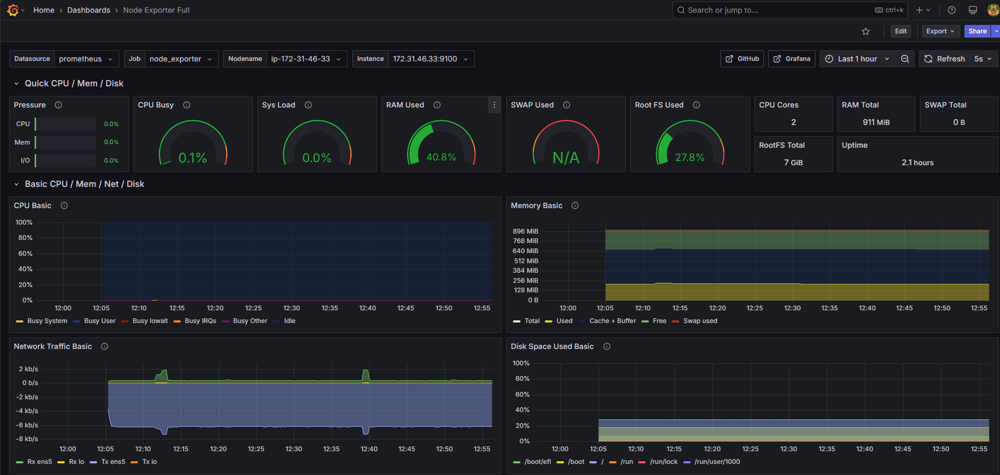
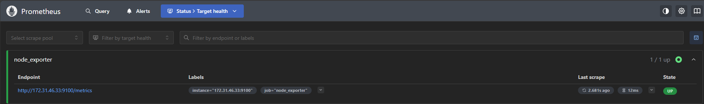
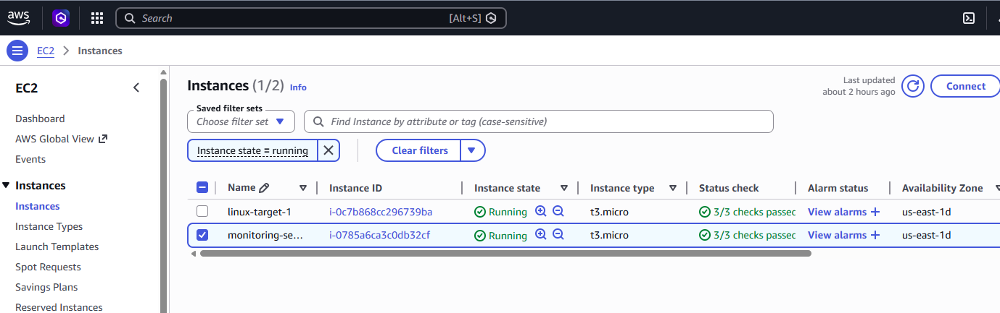

AWS Monitoring Stack (Prometheus + Grafana)

Overview

Deployed a real-time monitoring solution on AWS EC2 using Prometheus and Grafana to track Linux system performance metrics.

Architecture

\- Monitoring Server: Prometheus + Grafana

\- Target Server: Node Exporter (Linux)

\- Metrics scraped over private IP

Tech Stack

\- AWS EC2

\- Prometheus

\- Grafana

\- Linux (Ubuntu)

\- Node Exporter

What This Does

\- Collects system metrics (CPU, Memory, Disk, Network)

\- Visualizes data in Grafana dashboards

\- Simulates real-world production monitoring

Screenshots

Grafana Dashboard

Prometheus Targets

EC2 Instances

Key Takeaways

\- Built and configured a monitoring stack from scratch

\- Understood Prometheus scraping and exporters

\- Gained hands-on AWS + Linux experience

